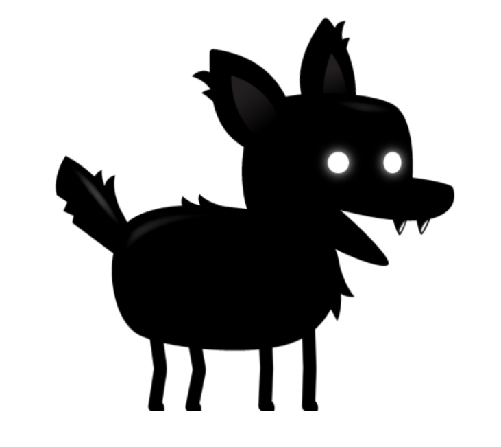

#JavaScript-Game-Development

<a name="readme-top"></a>
<!-- PROJECT LOGO -->
<br />
<div align="center">
  <a href="https://github.com/erick-hz/JavaScript-Game-Development">
    
  </a>

  <h3 align="center">JavaScript Game Development</h3>

  <p align="center">
    <a href="https://github.com/erick-hz/JavaScript-Game-Development"><strong>Explore the docs »</strong></a>
    <br />
    <br />
    <a href="https://github.com/erick-hz/JavaScript-Game-Development">View Demo</a>
    ·
    <a href="https://github.com/erick-hz/JavaScript-Game-Development/issues">Report Bug</a>
    ·
    <a href="https://github.com/erick-hz/JavaScript-Game-Development/pulls">Request Feature</a>
  </p>
</div>


<!-- TABLE OF CONTENTS -->
<details>
  <summary>Table of Contents</summary>
  <ol>
    <li>
      <a href="#about-the-project">About The Project</a>
      <ul>
        <li><a href="#built-with">Built With</a></li>
      </ul>
    </li>
    <li>
      <a href="#getting-started">Getting Started</a>
      <ul>
        <li><a href="#installation">Installation</a></li>
      </ul>
    </li>
    <li><a href="#roadmap">Roadmap</a></li>
  </ol>
</details>


<!-- ABOUT THE PROJECT -->
## About The Project

[![Product Name Screen Shot][product-screenshot]](https://example.com)

2D games with HTML, CSS & plain vanilla JavaScript, no frameworks and no libraries!

<p align="right">(<a href="#readme-top">back to top</a>)</p>


### Built With


<p align="right">(<a href="#readme-top">back to top</a>)</p>

<!-- GETTING STARTED -->
## Getting Started

### Installation

1. Clone the repo
   ```sh
   git clone https://github.com/erick-hz
   ```
<p align="right">(<a href="#readme-top">back to top</a>)</p>


<!-- ROADMAP -->
## Roadmap

- [x] Vanilla JavaScript sprite animation techniques
- [x] Parallax backgrounds with JavaScript
- [x] Enemy movement patterns
- [x] Collision animations from a sprite sheet
- [x] Point & shoot game
- [x] Enemy variety in JavaScript games
- [x] Side-scroller game with mobile support
- [x] State management in JavaScript games
- [x] Final endless runner game with all the features 

<p align="right">(<a href="#readme-top">back to top</a>)</p>

<!-- MARKDOWN LINKS & IMAGES -->
[product-screenshot]: https://github.com/erick-hz/JavaScript-Game-Development/images/banner.png

